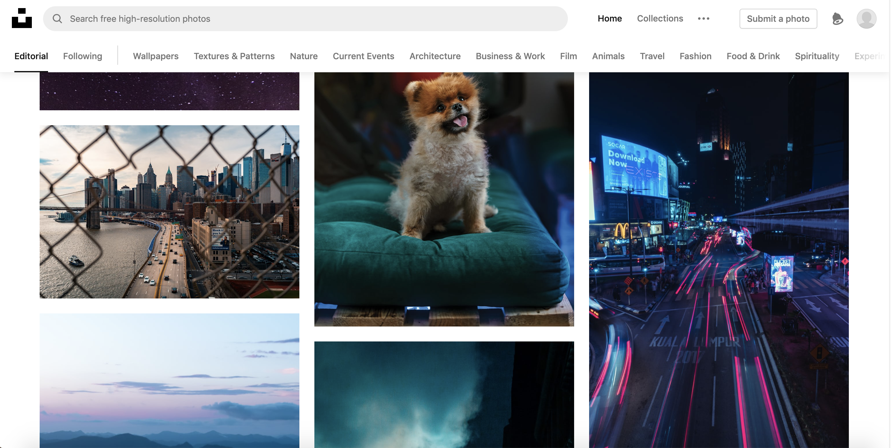
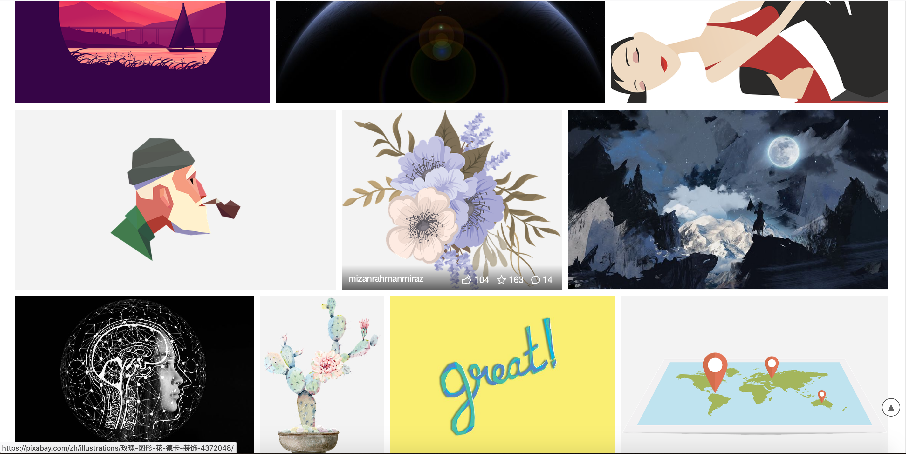
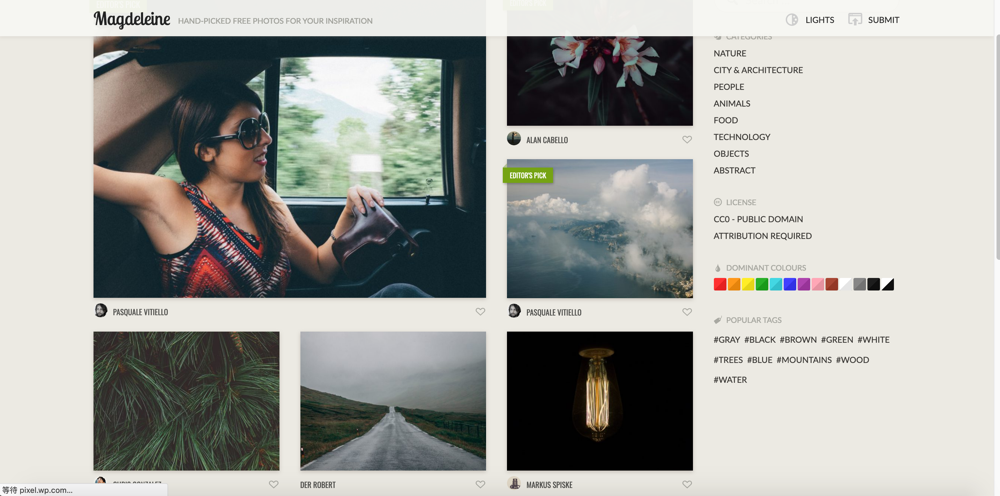
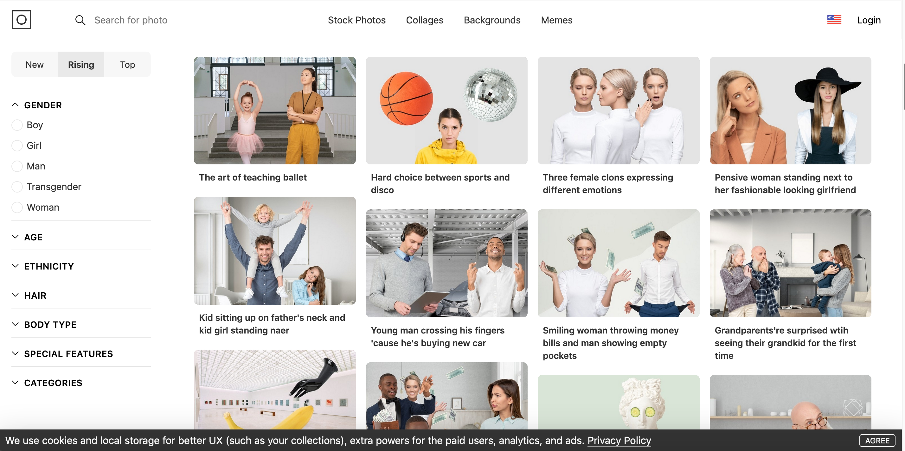

# 优质图片网站资源

[unsplash：高质量全免费的图片网站，网站图片质量很高](https://unsplash.com)

[Pexels - 是一家国外的免费高清图片网站。适合寻找风景图和各类职场、商业场景大图。目前只支持英文搜索](https://www.pexels.com)

[Pixabay：高质量的免费图片及插图](https://pixabay.com/)

[Magdeleine - 是一个每天分享免费高分辨率照片的网站,该网站也是一个激发你灵感的图库站点，每天手工挑选高分辨率的各种图片，主要类别有自然、城市建筑、动物、视频、技术等](https://magdeleine.co/browse/)

[500px - 部分免费，版权付费照片平台，照片售价都不菲，特别是商用的照片](https://500px.com/home)

[Picjumbo - 在线免费高质量素材网](https://picjumbo.com/)

[Gratisography - 免费高分辨率摄影图片库是一个提供免费高品质摄影图片的集散地,所有的图片都可以用于个人或者商业用途](https://gratisography.com/)

[Icons8 — 如果需要图片素材，大部分情况下我们会去免费图库寻找，若是更专业、个人化的图片只能搭景拍摄。也许因为一组照片而花费许多预算，折衷下好像难有其他选择。有鉴于此，国外团队开发出「Moose Photos」线上图片制造器，让使用者自行挑选背景图、配件和人物，利用拖曳、放大缩小等方式设计出更符合个人需求的图片，让图片不会太过生硬](https://photos.icons8.com/)

[librestock：免费资源网站，感觉素材质量一般，可作为备选](https://librestock.com)

