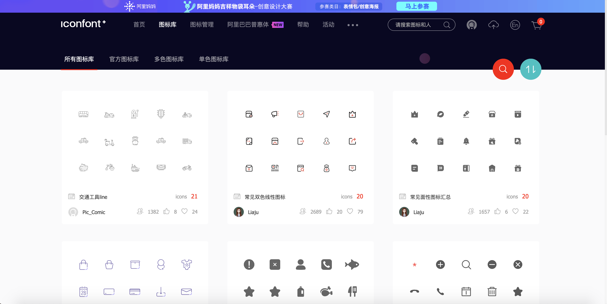
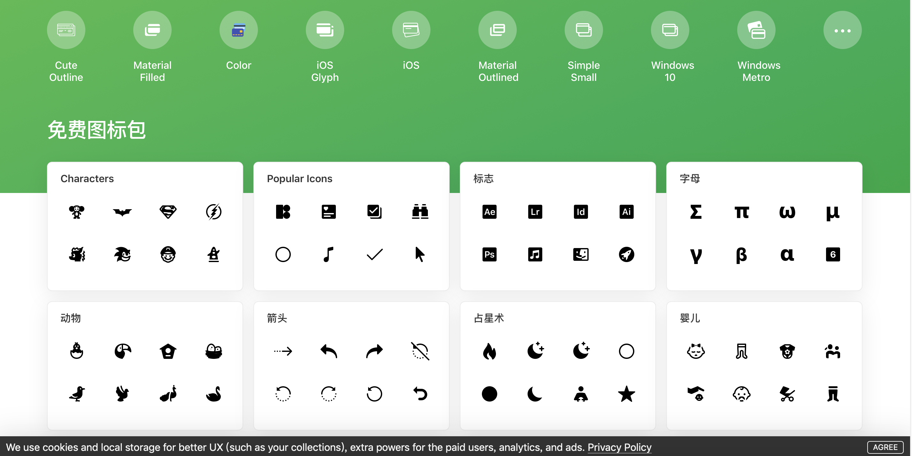
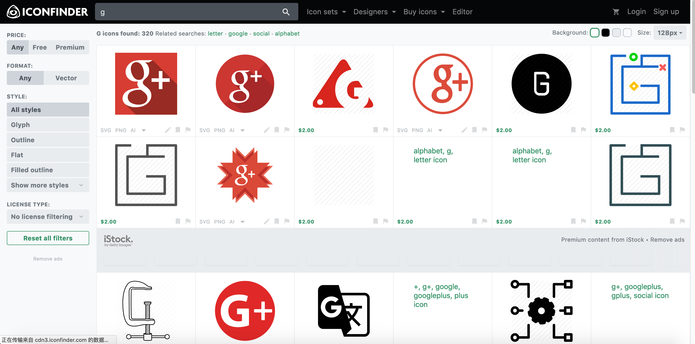
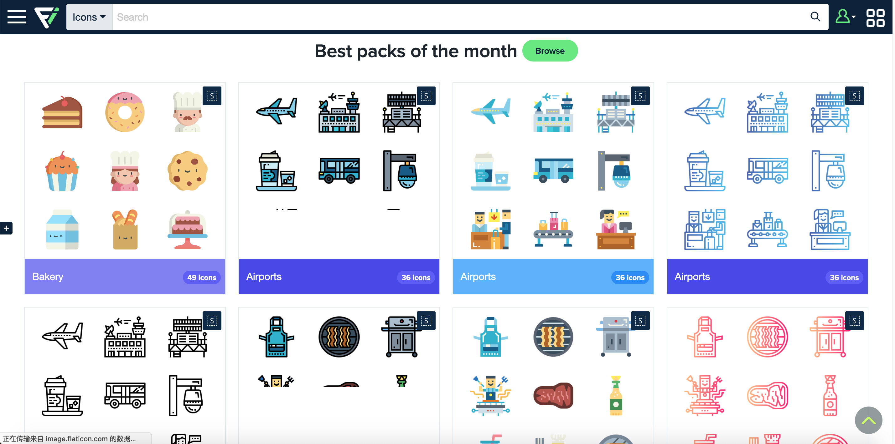
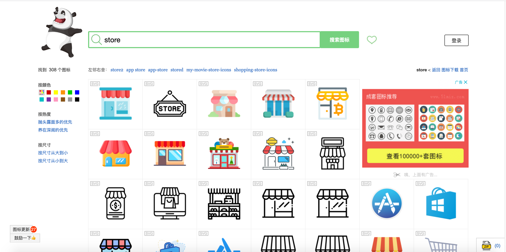
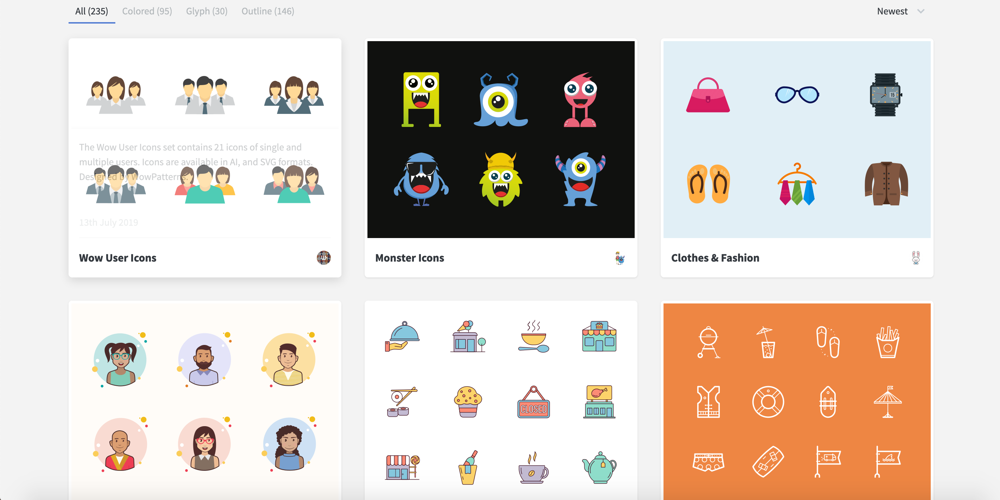
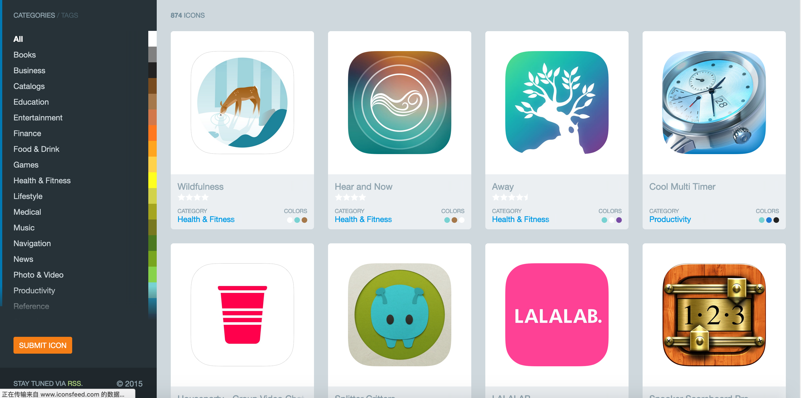
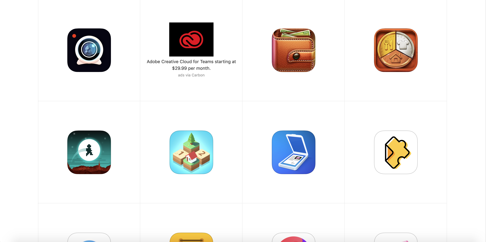
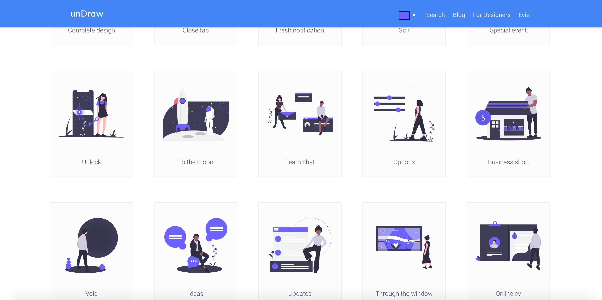
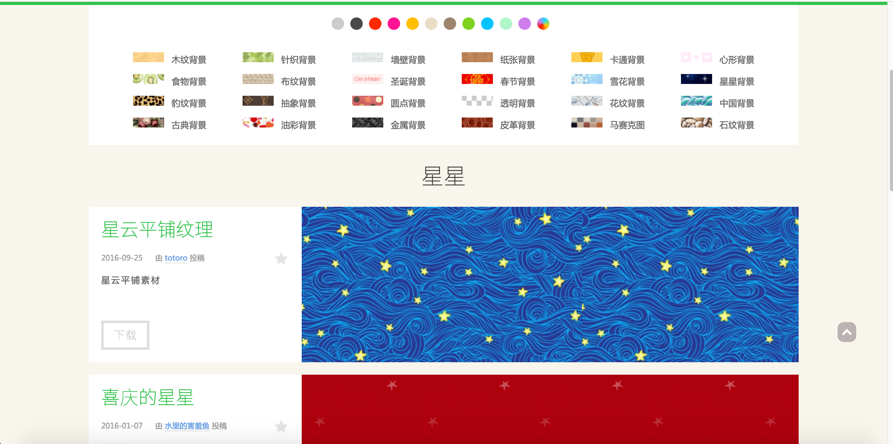

# 图标、插图

[阿里巴巴矢量图标库 - Iconfont](https://www.iconfont.cn/collections/i)

[Icons8 - 免费的图标，质量很高，可以下载到iPhone、安卓手机的原生icon](https://icons8.cn/icons)

[Iconfinder - 国外比较大的icon搜索引擎，并可以像阿里icon一样在线编辑](https://www.iconfinder.com/)

[Flaticon - Free vector icons - SVG, PSD, PNG, EPS & Icon Font - Thousands of free icons](https://www.flaticon.com/)

[Easyicon  - 免费矢量图标下载](https://www.easyicon.net/iconsearch/store/?s=addtime_DESC)

[iconstore - 是一个提供一流的免费图标包素材的站点,汇集了很多优质的icon素材,设计师可以自由下载使用,适用于网页设计、移动端设计等](https://iconstore.co/)

[IconsFeed - App icon网站是一个致力于iOS系统应用图标收集和分享的素材站点,通过多种分类来展示各个不同iOS应用图标的多种设计样式](http://www.iconsfeed.com/)

[IosIconGallery.com - 收录了苹果客户端的所有的ios产品的图标,很齐全很精美,是我们做ios app设计良好的素材](https://www.iosicongallery.com/)

[undraw.co - 插图svg 素材 -免费](https://undraw.co/illustrations)

[vecteezy.com - 矢量、插图、封面、插画背景](https://www.vecteezy.com/)

[hituyu.com - 图鱼 - 100%完美平铺的底纹背景](http://www.hituyu.com/)

#提升资源/UI资源整理