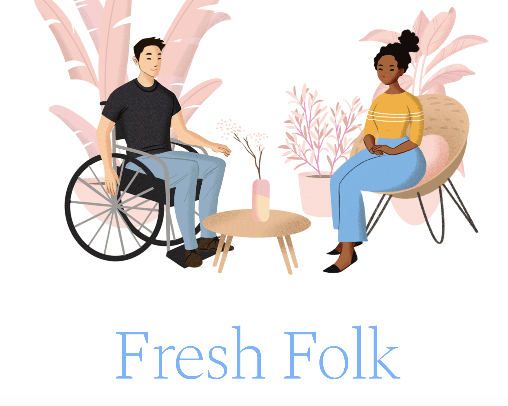
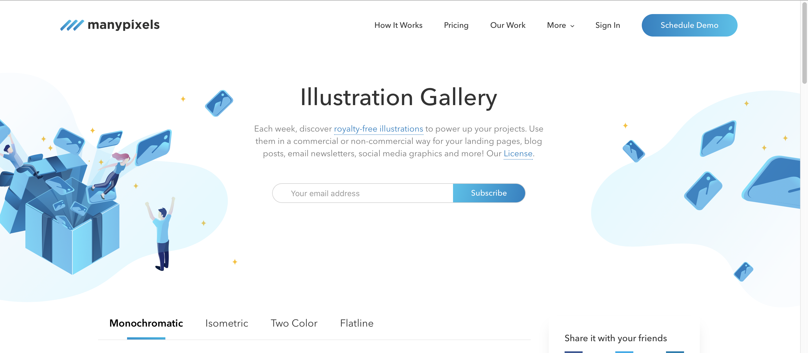
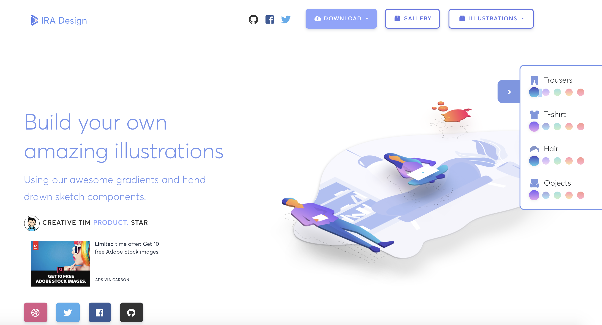
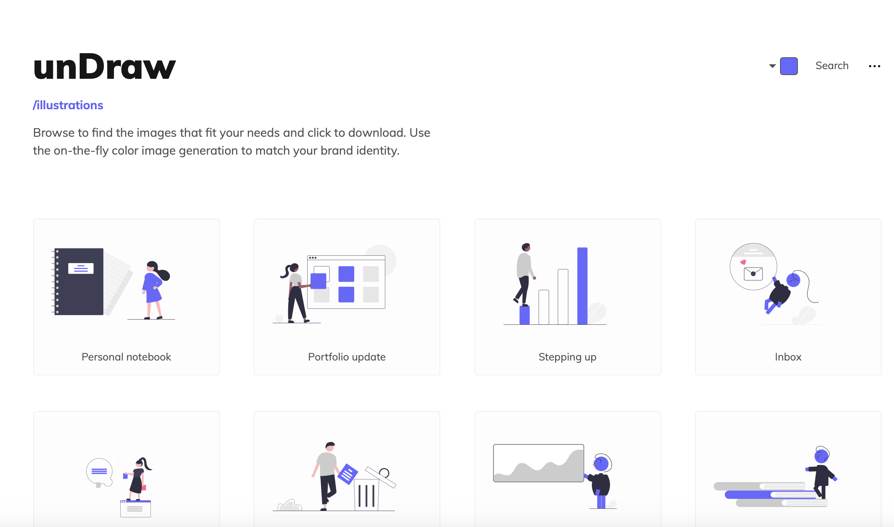
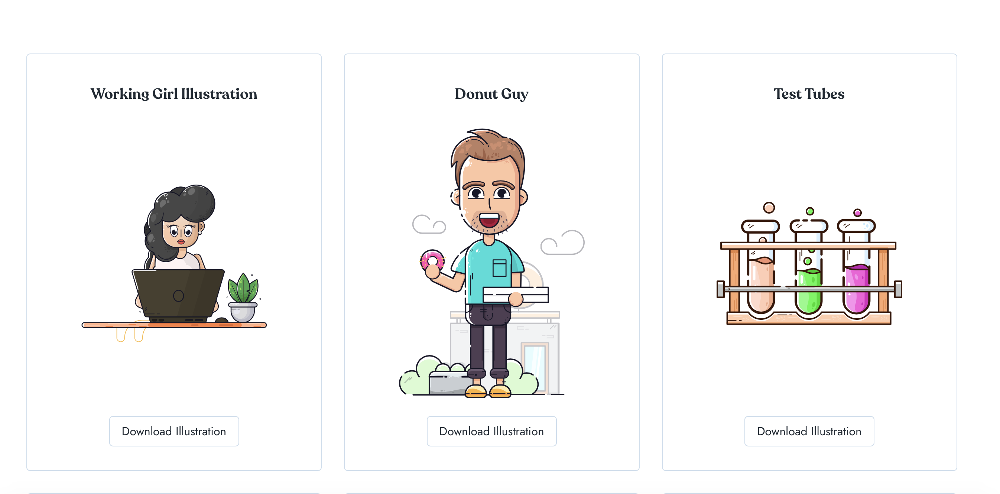
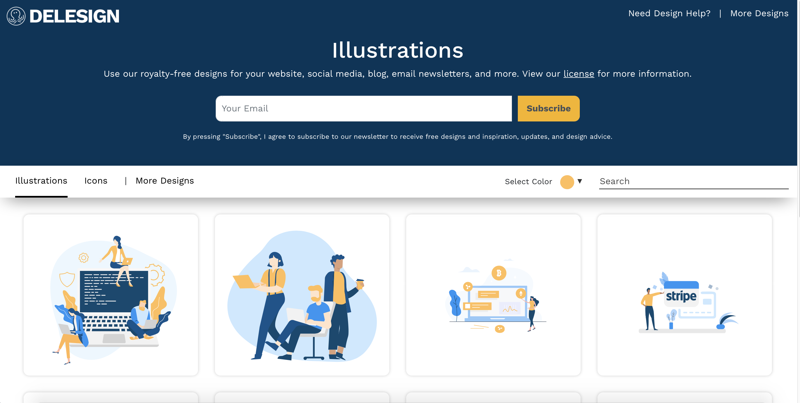
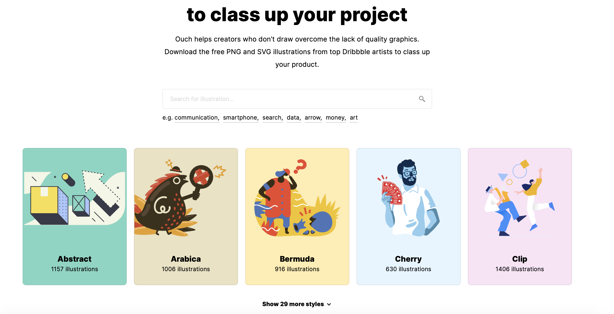

# 插画
## [Fresh Folk](https://fresh-folk.com)
Fresh Folk是由美籍日裔插画家LENI KAUFFMAN创建的高质量插画库，是完全免费且可商用的

## Gallery.manypixels
来自ManyPixels设计团队，完全免费且可商用的一个插画库，可搜索关键字，可以任意改颜色，插画形式也非常舒服，重点是可下载格式有svg和png，非常方便。

## IRA Design
IRA是一款渐变风格的矢量插画素材网站，质量非常高，并且也是免费可商用。可在线改变五种颜色

## [unDraw](https://undraw.co/illustrations)
unDraw是一个扁平风格插画图库，里面有大量的插画，可以支持在线更改配色，完全免费商用，支持一键下载svg和png格式。

## Lukaszadam
Lukaszadam也是一款免费可商用的插画图库，重点是这款插画图库里面包含了很多种不同种类的风格，而且下载下来的文件也很人性化，如下下图所示，有一二三倍图，还有源文件，考虑的很周到。看到心仪的插画，可以直接下载为你所用，省心，是个懂事的图库。这样的图库当然要收藏了

## VECTOR CREATOR
VECTOR CREATOR是 Icons8 最新推出的一款免费矢量插图设计工具，免费可商用，支持导出png格式。它最突出的特点就是可以在线自由操作，内置了极多个元素，满足你的所需，网站主页的动图，大家感受下，完完全全迎面扑来的友好气息！下下图是随意diy（大概20秒的样子）的一个插图，左侧是各个元素的分类，很是友好。

## Ouch！
同是由 icons8 团队推出的高质量矢量插画素材网站 ,随便贴一张视觉都是很棒的享受，内容稍许搞怪，也很有意思

