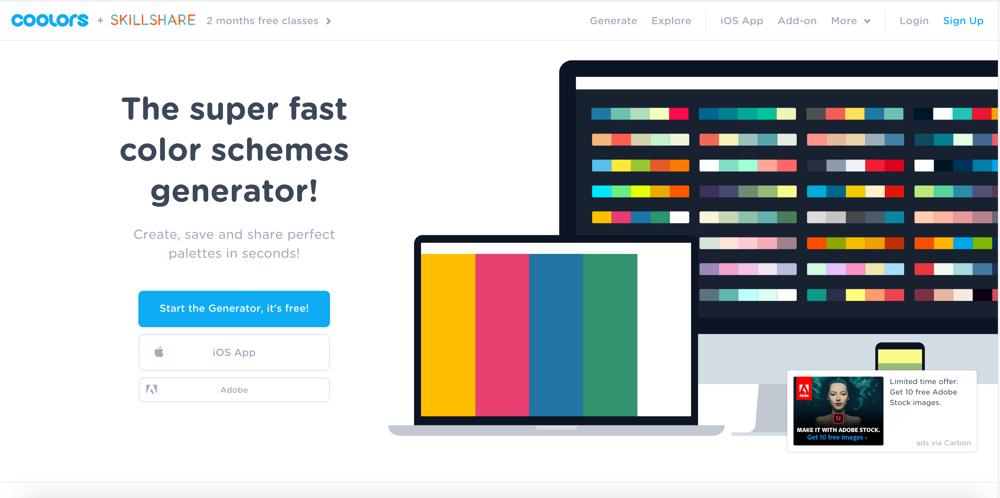
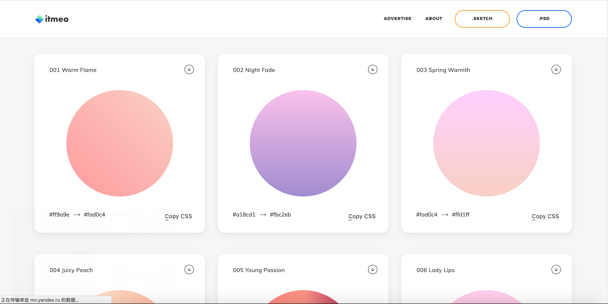
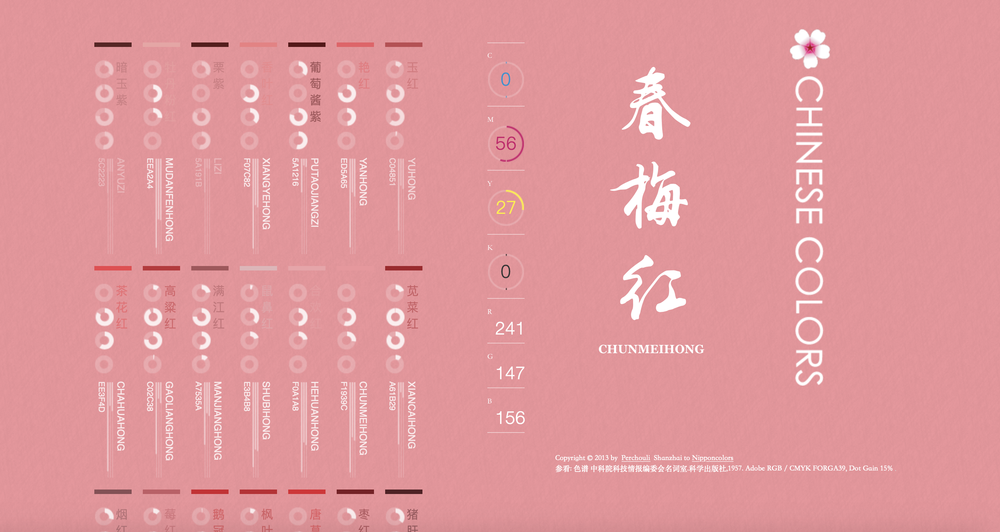

# 色彩搭配
[Coolors - 极简的配色方案生成器](https://coolors.co/)

[webgradients - 是一个设计师们经常需要用到的UI背景渐变颜色组合，目前提供180个渐变色彩，可以作为网站任何部分的内容背景，设计师可轻松复制颜色代码到CSS里，同时还支持PSD和PNG版本](https://webgradients.com/)

[zhongguose.com](http://zhongguose.com/#chunmeihong) 中国传统颜色, 当你点击一个颜色后网页会跟随着变化，让你切身体验配色的效果

